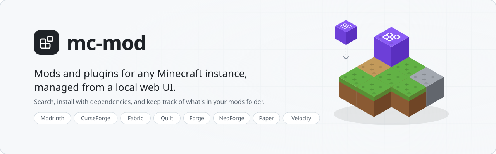
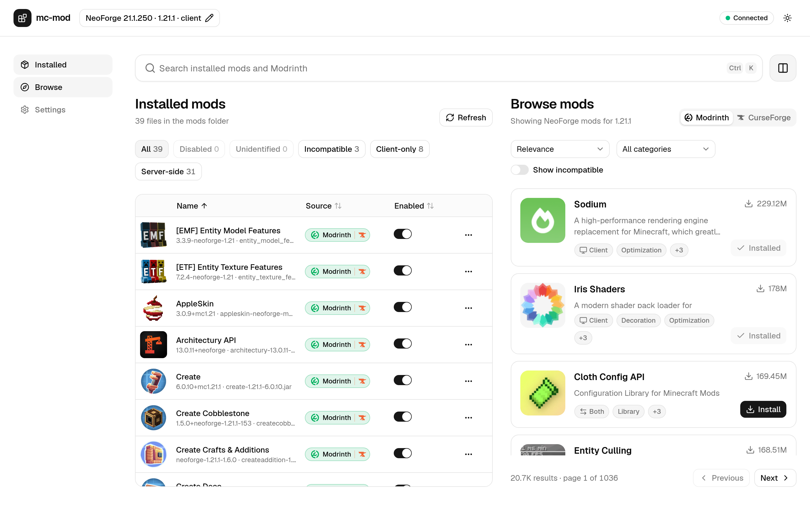
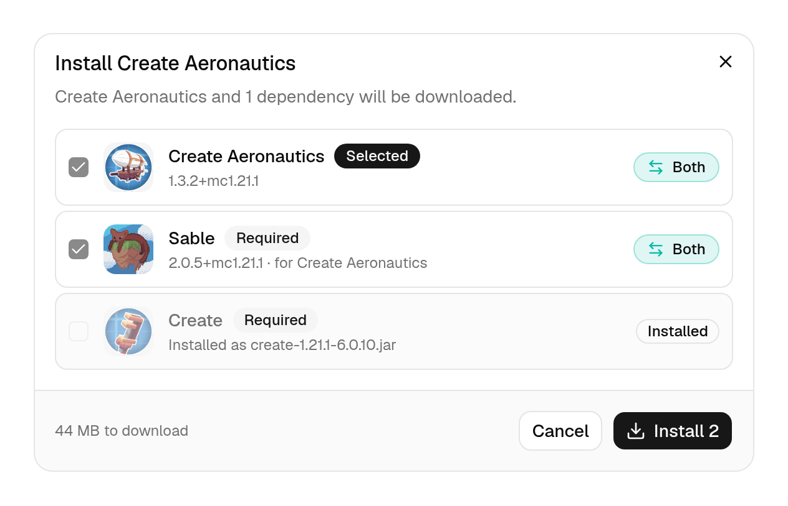
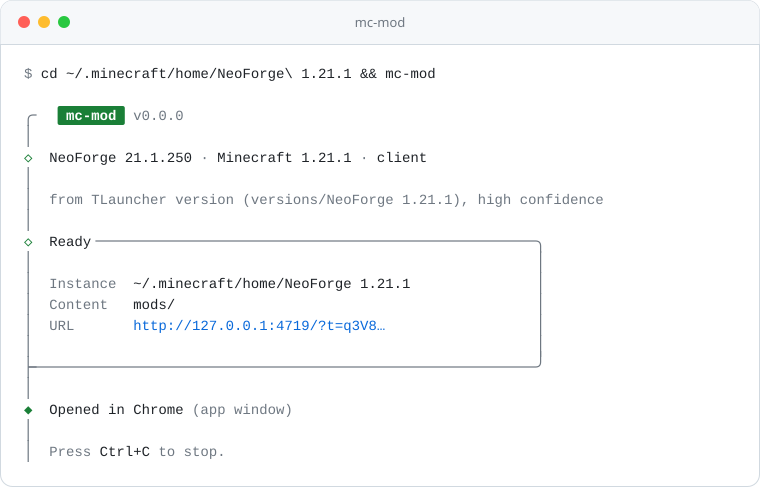
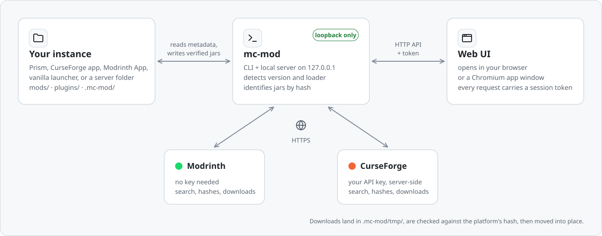

<picture>
  <source media="(prefers-color-scheme: dark)" srcset="docs/images/banner-dark.svg">
  
</picture>

`mc-mod` is a command-line tool for managing the mods and plugins of a Minecraft instance or server.
Run it in the instance's folder and it opens a local web UI. The UI shows what's installed, searches
Modrinth and CurseForge, and installs the right version for that instance's game version and loader,
with its required dependencies.

> **Status: work in progress, not yet published.** Listing, search, install and updates work. Server
> export is next. See [Roadmap](#roadmap).

<picture>
  <source media="(prefers-color-scheme: dark)" srcset="docs/images/ui-dark.png">
  
</picture>

## Features

- **Detects the instance.** It reads the game version and loader from the files that launchers and
  servers already write, so you don't have to set them.
- **Identifies installed jars by hash.** It matches each file against Modrinth and CurseForge, and
  falls back to the jar's own metadata when there's no match. Jars built for the wrong loader or game
  version are flagged.
- **Searches Modrinth and CurseForge**, showing only results for your version and loader.
- **Installs the best version**, with its required dependencies, after you confirm the plan.
  Downloads are checked against the platform's hash before they're moved into `mods/` or `plugins/`.
- **Updates jars.** "Check updates" finds the version it would install today for each identified jar,
  and you can update one, all of them, or switch a jar to any other version. The new file is downloaded
  and checked before the old one moves to `.mc-mod/trash/`.
- **Enables, disables and removes jars.** Disabling renames the file to `.jar.disabled`. Removed jars
  go to `.mc-mod/trash/` and aren't deleted.
- **Runs on your machine only.** The server listens on `127.0.0.1` and needs a per-run session
  token. See [Security](#security).

<p align="center">
  <picture>
    <source media="(prefers-color-scheme: dark)" srcset="docs/images/install-dark.png">
    
  </picture>
  <br>
  <sub>Installing a mod shows its plan first: required dependencies are added, and ones you already have are skipped.</sub>
</p>

### Supported instances

| Kind | Detected from |
|---|---|
| Prism Launcher / MultiMC | `mmc-pack.json` |
| CurseForge app | `minecraftinstance.json` |
| Modrinth App | `profile.json` |
| ATLauncher | `instance.json` |
| Vanilla launcher, TLauncher | `versions/<id>/<id>.json`, `launcher_profiles.json` |
| Fabric, Quilt, Forge and NeoForge servers | launcher jars, `libraries/`, `run.sh` |
| Paper, Purpur, Spigot, Bukkit and Folia servers | `paper-global.yml`, `purpur.yml`, `spigot.yml`, … |
| Velocity, BungeeCord and Waterfall proxies | `velocity.toml`, BungeeCord `config.yml` |

If none of these match, it guesses from the jars in `mods/`. If it still can't tell, the UI asks you
for the version and loader and remembers the answer. Details are in
[artifacts/instance-detection.md](artifacts/instance-detection.md).

## Requirements

- [Bun](https://bun.com) 1.3 or newer
- A browser. A Chromium-based browser (Chrome, Edge, Brave, Chromium) opens the UI in its own window.

## Install

`mc-mod` isn't on the npm registry yet. To install it from source:

```sh
git clone https://github.com/nexuls/mc-mods-manager.git
cd mc-mods-manager
bun install
bun run build
cd apps/cli && bun link
```

`mc-mod` is then available in your shell. Once it's published, you'll be able to install it with
`bun add -g mc-mod`.

## Usage

Go to the instance or server folder and run `mc-mod`:

```sh
cd ~/.local/share/PrismLauncher/instances/MyPack
mc-mod
```

It prints what it detected and opens the UI. Press Ctrl+C to stop it.

<picture>
  <source media="(prefers-color-scheme: dark)" srcset="docs/images/terminal-dark.svg">
  
</picture>

You can also point it at a folder, or start it from inside `mods/` or `plugins/`:

```sh
mc-mod -d ~/servers/survival
```

### Options

| Option | Description |
|---|---|
| `-d, --dir <path>` | Instance directory to manage. Default: `$MC_MOD_DIR`, then the current directory. |
| `-p, --port <port>` | Port to listen on. Default: `4719`, or a free port if that one is taken. |
| `--no-open` | Don't open a browser. Just print the URL. |
| `-b, --browser <mode>` | `auto` (default) uses an app window if a Chromium browser is found and a tab otherwise. `app` always uses an app window, `tab` always uses a tab. |
| `--exit-on-close` | Stop the server about a minute after the UI is closed. |
| `-v, --version` | Print the version. |
| `-h, --help` | Show help. |

### On a remote server

Run it without opening a browser and forward the port over SSH:

```sh
# on the server
mc-mod --no-open -p 4719

# on your computer
ssh -L 4719:127.0.0.1:4719 you@server
```

Then open the URL that `mc-mod` printed, including its `?t=` token, in your local browser.

### CurseForge

Modrinth works without any setup. CurseForge's API needs a key:

1. Create a key in the [CurseForge developer console](https://console.curseforge.com/).
2. Paste it in **Settings** in the UI. You can test it there too.

You can also set the `CURSEFORGE_API_KEY` environment variable, which takes priority over the saved
key. The key is only used by the local server. It's never sent to the browser.

Without a key, CurseForge mods installed by the CurseForge app, Prism or ATLauncher are still
recognized from those launchers' own records.

Some CurseForge authors don't allow third-party downloads. For those files, the UI shows a
**Download** link to the file's page. Once you've put the jar in `mods/`, `mc-mod` identifies it.

## Files it writes

| Path | Contents |
|---|---|
| `<instance>/.mc-mod/state.json` | Version and loader overrides, links you set by hand, and a hash cache. Safe to delete: jars are identified again by hash. |
| `<instance>/.mc-mod/tmp/` | Downloads that haven't been verified yet |
| `<instance>/.mc-mod/trash/` | Removed jars |
| `~/.config/mc-mod/config.json` | Global settings and the CurseForge key, readable only by you (`%APPDATA%\mc-mod\Config\` on Windows, `~/Library/Preferences/mc-mod/` on macOS) |

It changes nothing else in the instance except the jars in `mods/` or `plugins/`.

## How it works

<picture>
  <source media="(prefers-color-scheme: dark)" srcset="docs/images/how-it-works-dark.svg">
  
</picture>

`mc-mod` is both the command and the server. It works out the instance's game version and loader,
then serves the web UI and a JSON API on `127.0.0.1`. The API is what reads your jars, talks to
Modrinth and CurseForge, and writes files. The browser only talks to that local server. The design
is in [artifacts/architecture.md](artifacts/architecture.md).

## Security

The server listens only on `127.0.0.1`. It rejects requests that don't carry the session token for
that run, and requests with an unexpected `Host` header. File changes stay inside the instance
directory. Downloads come only from Modrinth's and CurseForge's CDNs over HTTPS, and are checked
against the platform's hash.

To report a vulnerability, see [SECURITY.md](SECURITY.md).

## Roadmap

- [x] Instance detection
- [x] Installed mods: identify, enable/disable, remove
- [x] Search and install from Modrinth
- [x] CurseForge search, installs and identification
- [x] Update checks, and updating one mod or all of them
- [ ] Server export: copy the server-side mods to a folder or a zip for upload
- [ ] Publish to the npm registry, and standalone binaries

Progress is tracked in [artifacts/progress.md](artifacts/progress.md).

## Development

The repository is a Bun workspace:

```
apps/web         Vite + React + Tailwind + shadcn/ui (the UI)
apps/cli         Express server and the mc-mod command
packages/shared  zod schemas and the API contract, shared by both
artifacts/       design docs, specs, decisions and progress
```

```sh
bun install
cp apps/cli/.env.example apps/cli/.env.local   # set MC_MOD_DIR to a test instance
bun run dev          # CLI on :4719 and Vite on :5173, in a tmux session
bun run dev --kill   # stop it
bun run check        # Biome lint and format check
bun run typecheck
bun test
bun run build
```

Use a copy of an instance for `MC_MOD_DIR`, not the one you play on.

Bun is the only package manager, runtime and test runner. Read [AGENTS.md](AGENTS.md) before you
contribute. It covers the conventions, the safety rules and the commit style. The design is in
[artifacts/architecture.md](artifacts/architecture.md).

## License

[MIT](LICENSE)

`mc-mod` isn't affiliated with Mojang, Microsoft, Modrinth or CurseForge.
